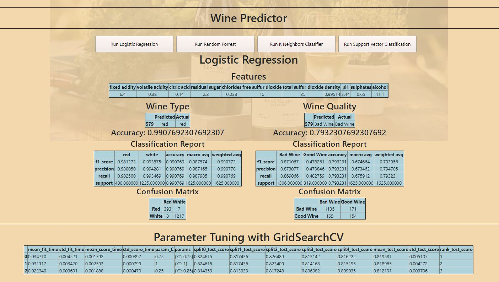

# wine_predictor
Using Python's Scikit-Learn to predict wine quality and type across multiple types of models. 

Dataset was taken from 
https://archive.ics.uci.edu/ml/datasets/Wine

Machine learning analysis predicing wine type with approx 99% accuracy and wine quality (2-9pnt scale) with approx 80% accuracy given the <strong>Machine Learning Features:</strong>
(fixed acidity,	volatile acidity,	citric acid, residual sugar,	chlorides,	free sulfur dioxide,	total sulfur dioxide,	density,	pH,	sulphates,	alcohol)

Models used:  
Logistic Regression 
Random Forest, 
K Neighbors Classifier, 
Support Vector Classification, 

Results are given using classification reports, Confusion Matrix report, and model parameters are tuned using GridSearchCV!

TO RUN APP:  CLONE GIT REPOSITORY OPEN CONSOLE or BASH AND NAVIGATE TO DIRECTORY  INPUT INTO CONSOLE:PYTHON APP.PY  NAVIGATE TO: ...  HTTP://LOCALHOST:5000  ... IN WEB BROWSER

